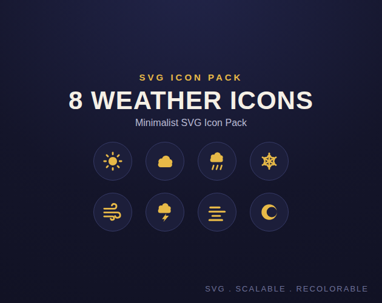

# 8 Weather Icons — Minimalist SVG Asset Pack

A small, clean set of 8 SVG weather icons for apps, dashboards, widgets and games: sun, cloud, rain, snow, wind, storm, fog, moon. Simple flat shapes, one color, no clutter — designed to stay legible at small sizes.

## What's in this repo

The 8 SVG icons, free to preview and use here on GitHub. Redistributing this exact pack as a standalone product isn't allowed — grab the packaged version (zip + README) from the product page.

- **Format:** SVG, scalable to any size without quality loss.
- **Best for:** weather widgets, forecast apps, dashboards, HUDs, onboarding screens — web, mobile or desktop.
- Monochrome by default; recolor freely to match your palette (edit the SVG `fill`, no special software required).

## Get the full pack

**[8 Weather Icons — Minimalist SVG Asset Pack ($3)](https://vincentdu2a.gumroad.com/l/tfuwr)**

## License

Free to use in personal and commercial projects. No attribution required. Not for resale or redistribution as a standalone icon pack.

## AI disclosure

This icon set was created with the assistance of generative AI tools as part of the design process, then reviewed and finalized before release.
